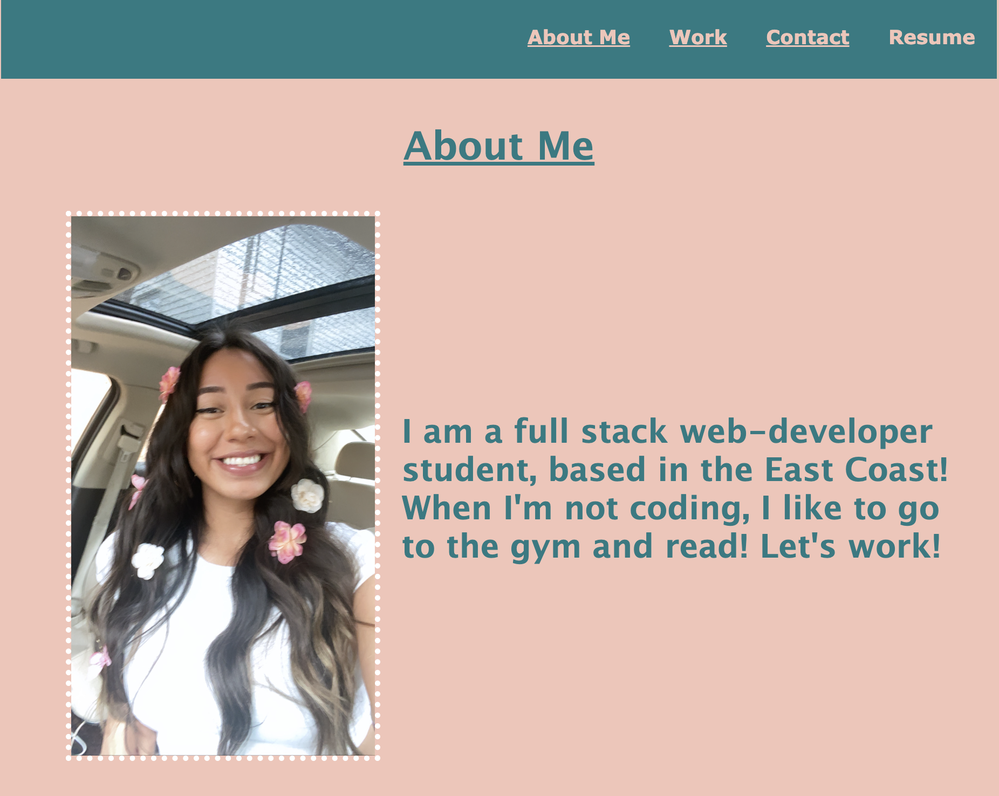
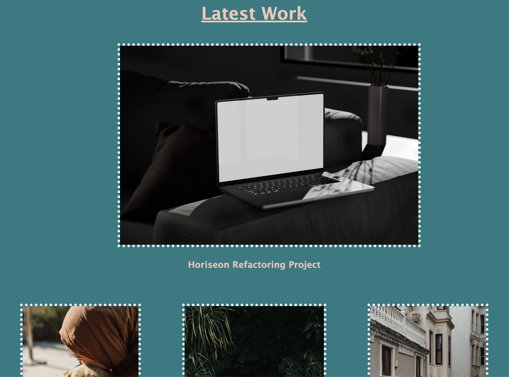
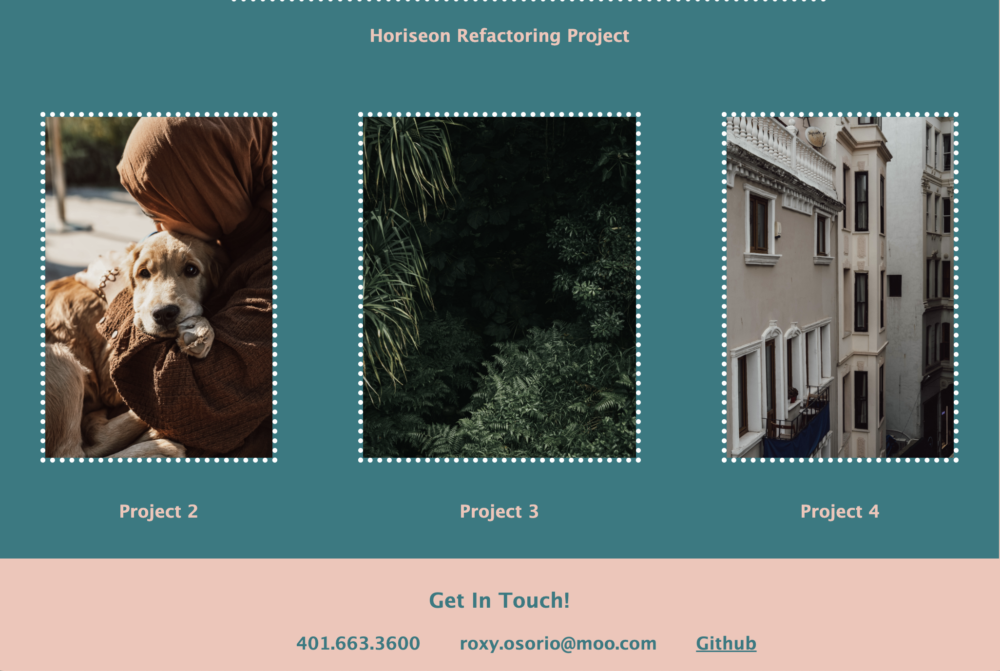

# Personal-Portfolio

## Description

This is my Personal Portfolio. As an aspiring web developer, my main job will be to create websites and application. Having a personal portfolio is a great way to showcase my technical skills and show potential clients and companies what I can do. Over time, I can continue to show my growth by adding projects and improve my web design.
When building my personal portfolio, it honed my CSS skills as I had to keep working on it so it could successfully look like the vision I had in my head.

## Installation

N/A

## Usage

I started from scratch when building my Personal Portfolio. Below is a screenshot of my finished Personal Portfolio.

You can access my Personal Portfolio below:
https://rosebudroro.github.io/Personal-Portfolio/